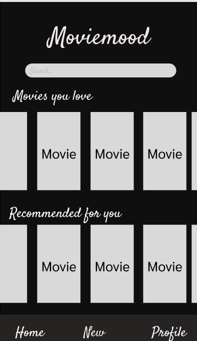

**What type of project will you work on? Will it be a web app, mobile app, or something else? What will your project do?**
I’m working on a web app where users can search for movies they like. Based on the movies they search for, the app will provide recommendations for similar movies that they may love. The app will fetch movie data from a database API, allow users to search for their favorite films, and then use an algorithm to generate recommendations that match their interests.

**Why did you choose to work on this project? What motivates you to choose this topic? (Answer with a minimum of 100 words)**

I decided to work on this project because I love watching movies and TV shows, but I’m always stuck trying to figure out what to watch next. Once I finish a great show or movie, I find it hard to find something similar that I’ll enjoy just as much. I know a lot of people feel the same way, and I thought it’d be really useful to create an app that can help solve that problem. By giving personalized movie recommendations based on what you like, I hope to make it easier for people to discover new shows and movies they’ll love without all the guesswork.

**Who is the target audience of this app? Be specific about the demographic (age / occupation), the type of devices they might use (computer, Apple phone, smartwatch, etc). (Answer with a minimum of 200 words)**
The target audience for this movie recommendation web app is anyone who enjoys movies and TV shows and is looking for new content to discover. However, the primary demographic falls within the age range of 18 to 45, since this group is the most active in looking for streaming content across various platforms like Netflix, Hulu, Amazon Prime, Disney+, and others. This age range includes college students, young professionals, and busy parents—all of whom frequently turn to streaming services for entertainment and relaxation during their downtime.

The app is designed to be used on a wide variety of devices, making it accessible to people across different contexts. It works on computers Windows or Mac for people watching from home or at work, as well as smartphones iOS or Android, making it convenient for wherever and whenever. Tablets also serve as an ideal platform for entertainment, and the app is optimized to ensure it runs smoothly on these devices. Since it's a web app, it doesn't require specific downloads or installations, which makes it even more accessible across all devices. This flexibility means that anyone can discover new content from their home computers, work laptops.

Even though its catered towards movie/tv show enthusiats, the app can also appeal to casual viewers, since people are always loking for new shows to watch. Whether they are watching from a desktop computer, smartphone, or tablet, users of all ages and occupations will find the app useful for quickly discovering their next favorite show or movie, based on personal preferences.

**What problem does your project hope to tackle? How will your final product help to solve this problem? How will the target audience you specified above benefit from your app? (Answer with a minimum of 200 words)**

The problem my project aims to tackle is the challenge of finding new movies and TV shows to watch, which is a commonly frustrating for people who love movies and tv shows but often get stuck when their tired of watching their go-tos or feel like theyve watched everything good. Many people spend a lot of time scrolling through streaming platforms, trying to find something similar to what they've enjoyed before. This leads to wasted time, as people are unsure of where to start.

My web app will help solve this problem by providing personalized recommendations based on users' tastes. After users search for a movie or TV show they like, the app will suggest similar titles that match their interests. The recommendations will be tailored based on the movie or genre the user inputs, which will take the guesswork out of finding new content. By offering suggestions based on a movie's theme, genre, or popularity, users will be able to discover new titles they may not have come across otherwise.

The target audience, from young adults to older generations, will greatly benefit from the app. Whether they are students, working professionals, or retirees, they will no longer waste time scrolling through endless lists of movies or TV shows. The app will give them quick, relevant recommendations that are personalized to their preferences, making their entertainment experience more enjoyable and efficient. This will save users time, reduce frustration, and enhance their viewing experience by helping them easily discover new favorites.

**Identify the programming language(s) you will need to learn in order to work on this project. Provide a link to the official documentation for this programming language. Also, please provide 3 free, easy-to-access resources that you can use to learn this programming language.**

For this project, the main programming languages I will need to learn are HTML, CSS, and JavaScript for the front-end of the web app. Additionally, I may need to learn a backend language like Node.js for fetching movie data from an API.

Official Documentation: https://developer.mozilla.org/en-US/docs/Web/HTML
Free Resources:
https://www.youtube.com/watch?v=OXGznpKZ_sA&t=30107s&ab_channel=freeCodeCamp.org
https://javascript.info/
https://www.youtube.com/watch?v=Ybn8zyL7KDA&t=273s&ab_channel=EyeOfTheCoder

**Identify the tools, frameworks, etc. you might need to learn in order to work on this project. Please provide a link to each.**
I will use React for Front-end
I will use Node.js for back-end
OMDb API (Open Movie Database) for movie data
links:
https://react.dev/
https://nodejs.org/docs/latest/api/
https://www.omdbapi.com/

**Figma Wireframe:**

